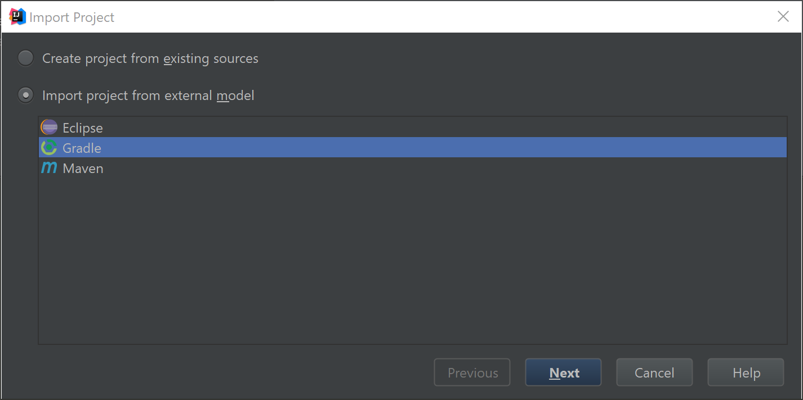
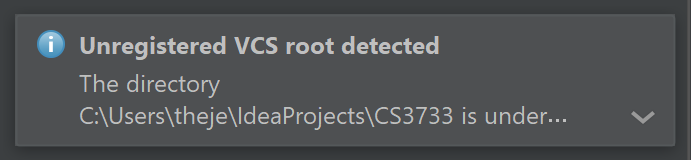
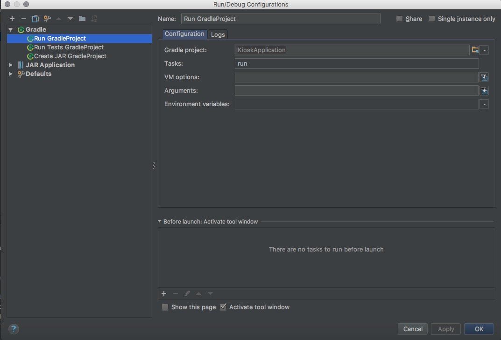
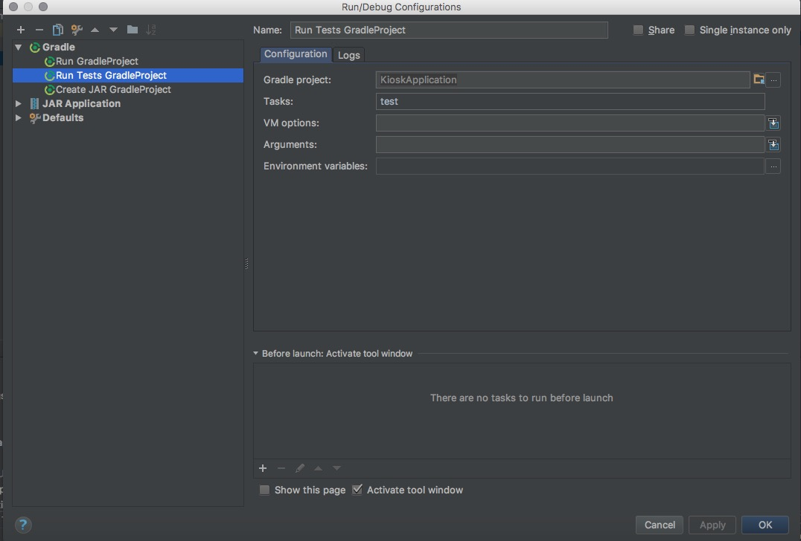
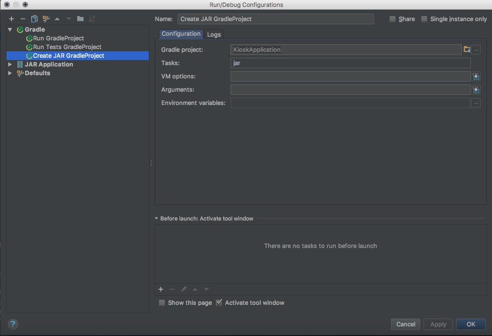

# CS3733

Add more readme stuff here...

# Setting up the project

If you have imported the project previously, you should close that project and not use it. Commit any work you have done and push that. Afterwards, get a fresh clone of the git repo. Start by importing a new project in IntelliJ. Navigate to the project directory and select it. Then IntelliJ should auto-select "Import project from external model" with the Gradle object highlighted. Click next. The preferences should already be set. For reference, it should look like the following screen:

Then finish the import. You should now have the project setup. To add the Git project to IntelliJ, a small box will appear in the bottom-left corner. It looks like this:

Click it and click "add to root." If the box disappears, you can click the bottom bar and then click "add to root." 

In order to run the project, you need to set up some run configurations. Click on the dropdown menu next to the run arrow and click "Edit Configurations." Click the green plus button, and select Gradle. Make the following configurations:

Name: Run
GradleProject: Click the folder icon and select this project
Tasks: run

Name: Run Tests
GradleProject: Click the folder icon and select this project
Tasks: test

Name: Create JAR
GradleProject: Click the folder icon and select this project
Tasks: jar

